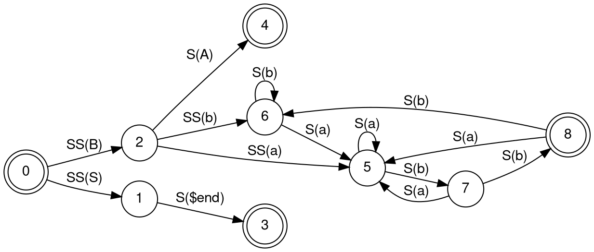

<h1 style="border: none; font-size: 72px">
Thinking with Portal
</h1>
<h2 style="border: none; font-size: 32px; color: white">
by Chris Badahdah
</h2>

---

# Who Am I?

- [@djblue](https://github.com/djblue/) online
- Software Development for ~10 years
  - Lots of Java and Javascript
  - Mostly Web Based Applications
- Got into Scheme with SICP
  - Found Clojure and ClojureScript
  - Immutable by default!
  - First class host interop!
- Doing Clojure Professionally for last ~5 years
  - Working on Portal for 5 years

<div style="position: absolute; left: 640px; top: 80px; width: 200px">

</div>

---

# Outline

- What is Portal
- How to use Portal (updated)
  - UI organization and concepts
    - Viewers
    - Selection
    - Filtering
- How to customize Portal
  - Connecting a REPL to UI
  - Building a Custom viewer
  - `portal.user`
- Future Ideas
- Questions

---

# What is Portal

- A tool to help with large JSON blobs

```clojure
(require '[clojure.data.json :as json])
(json/read-str (slurp "package-lock.json"))
```

- A target to `tap>` data
- A tool to leverage `datafy` and `nav`
- A webapp for pasting transit
  - [djblue.github.io/portal/](https://djblue.github.io/portal)

```json
["~#with-meta",[[["~#set",[1,3,2]],["^ ","~:hello","~$world"]],["^ ","^2",true]]]
```

- Ring server with reagent views hosted in your REPL

---

# Getting Started

Open a Portal instance

```clojure
(require '[portal.api :as p])
(p/open)
```

Start sending values to Portal

```clojure
(p/submit :hello)
```

```clojure
(doc tap>)
```

Tell `tap>` about Portal

```clojure
;; vars can be hand for redefs
(add-tap #'p/submit)
(tap> :world)
```

---

# Tap List

Get more data into Portal

```clojure
(tap> 42)
```

```clojure
(tap> [1 2 3])
```

- Hover over `@` to view pause / resume

```clojure
(tap> #{1 2 3})
```

```clojure
(tap> {:x 0 :y 0})
(tap> {:x 0 :y 1})
```

- Tap list is inverse chronological because `conj` and lists

```clojure
(conj '() 41 [1 2 3] #{1 2 3} {:x 0 :y 0} {:x 0 :y 1})
```

---

# Selection

- Mouse hover will show selection preview
- Single click to select a value
  - Click again to de-select
- `e` / `space` to expand / collapse a value
- `cmd` / `alt` + click to select multiple values
  - `esc` to pop selection
- Get selected value back in repl

```clojure
(p/selected)
```

- Run REPL code against selected values
  - Bring data to code

```clojure
(map name (p/selected))
```

---

# Viewers

- Bottom left to change viewer
  - `v` will open the same menu
- `shift` + (`🡅` | `🡇` | `j` | `k`) to cycle through viewers

```clojure
(tap> [{:id :a :color :blue} {:id :b :color :red}]) ;; looks like a table
```

- Specify default viewers programmatically via metadata

```clojure
(require '[portal.viewer :as v])
```

```clojure
(tap> (v/tree (range 10)))
```

```clojure
(tap> (v/text "hello\nworld\n123"))
```

```clojure
(tap> (v/code "(+ 1 2 3)"))
```

---

# Filtering

- Filtering is relative to the currently selected value
  - Disabled until something is selected
  - Filtered values may have an indicator
    - Useful for clearing filter
- Viewers can specialize filtering
- Portal will attempt to highlight matched text
  - Some viewers don't support this

---

# Commands

- Bottom right to open command palette
  - `:` will do the same
- Any function var can be a command
  - Bring code to data

```clojure
(p/register! #'identity)
(p/register! #'hash-set)
```

```clojure
(doc p/inspect)
```

```clojure
(p/inspect (read-string (slurp "deps.edn")))
```

```clojure
(p/register! #'p/inspect)
```

- `portal.data/select-columns` is a handy command with extra UX
  - Some other `clojure.core` have a similar treatment (`select-keys`)

---

# History & Shortcuts

- Commands push values on history stack
- Top-left arrows will manipulate history
    - TIP: also works with Mouse 4 + Mouse 5
- Keyboard shortcuts are listed in the command prompt
- Relevant commands:
  - `portal.ui.commands/history-first`
  - `portal.ui.commands/history-last`

---

# UI REPL

Connect to SCI powered UI runtime via nREPL

```clojure
(p/repl)
```

```clojure
(+ 1 2 3)
```

```clojure
#js [1 2 3]
```

```clojure
(throw (ex-info "hi" {}))
```

```clojure
(str *ns*)
```

```clojure
(in-ns 'cljs.user)
```

```clojure
:cljs/quit
```

```clojure
(clojure-version)
```

---

# Custom Viewer

```clojure
(require '[clojure.pprint :refer [pprint]])

(defn my-viewer [x]
  [:bold
   {:style
    {:font-size 18
     :color (rand-nth [:red :green :blue])}}
   [:pre (with-out-str (pprint x))]])
```

```clojure
(require '[portal.ui.api :as pui])

(pui/register-viewer!
 {:name :hello/world
  :predicate any?
  :component #'my-viewer})
:done
```

```clojure
:cljs/quit
```

```clojure
(require '[portal.viewer :as v])
(tap> (v/default {:hello :world :range (range 25)} :hello/world))
```

---

# Leveraging Ecosystem

```clojure
(p/repl)
```

Access to ClojureScript ecosystem (via classpath)

```clojure
(require 'tetris.core)
(ns-publics 'tetris.core)
```

Access to npm ecosystem (via node_modules)

```clojure
(js/require "react")
```

You still need to solve packaging and distribution

---

# Graphviz

Load npm packages from `node_modules`

```clojure
(ns graphviz
  (:require ["@viz-js/viz/dist/viz.cjs" :refer [instance]]
            ["react" :as react]
            [portal.ui.api :as pui]))
```

Use react hooks to interop with npm ecosystem

```clojure
(defn- use-viz []
  (let [[viz set-viz!] (react/useState)]
    (react/useEffect
     (fn []
       (.then (instance) set-viz!))
     #js [])
    viz))
```

Define viewer as a reagent component

```clojure
(defn graphviz [graph]
  (let [viz (use-viz)
        [svg set-svg!] (react/useState nil)]
    (react/useEffect
     (fn []
       (when viz
         (set-svg! (.. viz (renderFormats graph #js ["svg"]) -output -svg))))
     #js [graph viz])
    [:div {:dangerouslySetInnerHTML {:__html svg}}]))
```

---

# Graphviz

Register viewer with Portal

```clojure
(pui/register-viewer!
 {:name ::dot
  :predicate (constantly true)
  :component #'graphviz})
:done
```



---

# `portal.user`

Convenience for automatically loading ClojureScript into Portal on load, much
like `user.clj` and `cljs/user.cljs`.

```clojure
(ns portal.user
  (:require [graph.viz]))
```

```clojure
:cljs/quit
```
---

# Thinking with Portal

Portal helps with digging through blobs of data

```clojure
(require '[satisfactory-planner.core :as factory])
(tap> (factory/fetch-json))
```

Lets you format that data in a meaningful way

```clojure
(tap> factory/all-recipes)
```

```clojure
(tap> factory/factory)
```

And build custom views for that data

```clojure
(tap> (factory/viz factory/factory))
```

---

# What is Portal

<br/>
<br/>
<br/>

### What I want Portal to be:

- A great tool to view and explore data at my REPL
- In my preferred runtime (jvm, bb, js, nbb, clr, python)
- With my favorite editor (VS Code, Intellij or Emacs)
- That is customizable via ClojureScript (sci)
- And sharable with my team and community

---

# Future

- Improve docs UX (doesn't need to be a viewer)
  - Remove the UX that doesn't align

```clojure
(p/docs)
```

- `Portal Apps` - AKA runtime connected shareable ClojureScript Apps
- Allow imported views from community to participate in `p/docs`
- Improve `portal.ui.api`

---

# Questions

Thanks for attending!

- [github.com/djblue/portal](https://github.com/djblue/portal) - github
- [djblue.github.io/portal/](https://djblue.github.io/portal/) - standalone app
- [cljdoc.org/d/djblue/portal/](https://cljdoc.org/d/djblue/portal/) - cljdoc